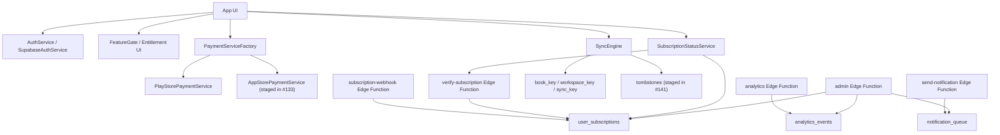

# Jive SaaS Beta 设计收口

> 日期: 2026-04-09
> 基线: `main@7b9b893`
> 范围: clean SaaS PR 队列

## 目标
这份文档不是再定义一轮新功能，而是把当前已经拆成 clean PR 的 SaaS Beta 能力收束成一套清晰、可合并、可验证的设计边界。

它回答 4 个问题：
- 当前 Beta 里，哪些能力已经进入正式主线候选
- 这些能力之间的依赖关系是什么
- 我们用什么产品和技术边界承接 SaaS 化
- 哪些能力明确延后，不在这一轮继续扩 scope

## 不在本轮范围
- RevenueCat 切换
- 端到端加密或密钥管理
- admin dashboard UI
- analytics/report UI
- notification provider 或真实外发通道
- 新增 auth/payment provider
- 从旧污染分支继续派生新功能

## 当前 clean PR 主链

### 基础与文案
- `#139` `docs(saas): restack sync safety wording onto main`
- `#142` `chore(saas): add Wave 0 smoke lane`

### Sync
- `#136` `feat(saas): restack B1.1 book/workspace boundaries onto main`
- `#140` `feat(saas): restack B1.2 sync-key architecture onto clean B1.1`
- `#141` `feat(saas): restack B1.3 tombstone sync onto clean B1.2`

### Billing webhook
- `#122` `feat(saas): extract B2.2 subscription webhook branch`
- `#131` `feat(saas): add Apple App Store webhook handling`

### Billing truth
- `#124` `feat(saas): wire subscription truth to auth and lifecycle`
- `#133` `feat(saas): add App Store payment service`
- `#138` `feat(saas): verify Apple purchases against server truth`

### Auth
- `#134` `feat(saas): restack phone and Apple auth entrypoints onto main`
- `#135` `feat(saas): restack email auth reset flow onto main auth stack`

### Ops
- `#127` `feat(saas): add analytics event pipeline`
- `#128` `feat(saas): B5.2 notification queue backend`
- `#129` `feat(saas): add admin user management api`
- `#130` `feat(saas): add ops overview summary`

## Beta 架构总览

## 一、数据与同步边界

### 1. `book` 是用户可见边界，`workspace` 是云端实现边界
当前 Beta 不引入新的本地 `workspace` 模型，而是继续以账本为产品对象。

设计约束：
- 用户看到的是 `book`
- 云端契约使用 `workspace_key`
- Beta 阶段默认 `workspace_key == book.key`

这样做的好处：
- 不打断现有账本心智
- 不需要在本地模型再平行扩一个新顶层容器
- 可以让同步层开始显式承认账本边界

相关基线：
- [saas-beta-boundaries.md](/Users/chauhua/Documents/GitHub/Jive/worktrees/codex-saas-beta-docs/docs/saas-beta-boundaries.md)
- `#136`

### 2. `shared_ledger` 是协作层，不是新的主容器
`shared_ledger` 继续保留，但它的角色是“附着在账本/工作空间上的共享协作记录”，而不是和 `book` 平级扩张出第二套归属体系。

Beta 语义：
- `book` 负责数据归属
- `shared_ledger` 负责成员、邀请、共享协作元数据
- `shared_ledgers.workspace_key` 只负责把共享协作层挂回账本边界

相关 clean PR：
- `#136`

### 3. 同步协议不再以 `local_id` 为中心
本地 Isar `int` 主键继续保留，但它只做本地索引和兼容映射，不再作为云端长期主身份。

当前收口方向：
- `book.key` 承接 `workspace_key`
- `account.key` 继续作为稳定账户标识
- B1.2 把核心同步对象往 `sync_key / account_sync_key / book_key` 迁移
- B1.3 用 tombstone 承接删除同步，而不是“本地删掉即真相”

相关 clean PR：
- `#136`：book/workspace 边界
- `#140`：sync-key 主协议
- `#141`：删除 tombstone

### 4. 删除同步正式进入协议层
Beta 不再把删除视为“本地副作用”，而是把删除记录显式写进同步协议。

设计结果：
- 有效 sync cursor 存在时，删除会被记录成 tombstone
- 下游设备通过 tombstone 回放删除
- 这让同步从“只会新增/覆盖”进化为“能长期运行的状态机”

相关 clean PR：
- `#141`

## 二、认证边界

### 1. Auth 公开能力收口为四种入口
Beta 认证主线是：
- Email 注册/登录
- 密码重置
- Phone OTP
- Google / Apple OAuth

但对外承诺只基于仓库和 PR 中已经具备实现与测试的入口，不提前宣传未配置完成的 provider。

当前主线：
- [auth_service.dart](/Users/chauhua/Documents/GitHub/Jive/worktrees/codex-saas-beta-docs/lib/core/auth/auth_service.dart)
- [supabase_auth_service.dart](/Users/chauhua/Documents/GitHub/Jive/worktrees/codex-saas-beta-docs/lib/core/auth/supabase_auth_service.dart)
- `#134`
- `#135`

### 2. 游客模式继续存在，但不再替代真实登录闭环
游客模式仍保留作为产品缓冲层，但 Beta 认证设计已经把真实登录放回主路径：
- 用户可以先作为游客进入
- 当需要同步、订阅真相、共享等能力时，切换到 Supabase Auth
- entitlement 刷新以登录态变化为触发条件之一

## 三、订阅与付费边界

### 1. `user_subscriptions` 是唯一 entitlement 真相读取源
本轮不引入第二套 entitlement 源，也不切 RevenueCat。

设计约束：
- 客户端不再长期相信本地缓存就是最终真相
- 服务端用 `user_subscriptions` 作为统一订阅事实表
- 客户端只缓存 snapshot，并在关键生命周期刷新

主线：
- [subscription_status_service.dart](/Users/chauhua/Documents/GitHub/Jive/worktrees/codex-saas-beta-docs/lib/core/payment/subscription_status_service.dart)
- [verify-subscription/index.ts](/Users/chauhua/Documents/GitHub/Jive/worktrees/codex-saas-beta-docs/supabase/functions/verify-subscription/index.ts)
- `#124`
- `#138`

### 2. Billing 分成三层

#### 服务端 webhook 层
负责订阅事件推送真相：
- Google RTDN
- Apple App Store Server Notifications v2

clean PR：
- `#122`
- `#131`

#### 服务端 verify 层
负责购买后的主动验票：
- Google 路径已有基础
- Apple 路径在 `#138` 中接到 `verifyReceipt` + `21007` fallback

#### 客户端 payment 层
负责平台路由和购买/恢复交互：
- Android 走 Google Play
- iOS/macOS 走 App Store
- 客户端通过 factory 选平台实现，而不是永远初始化 Google Play

clean PR：
- [play_store_payment_service.dart](/Users/chauhua/Documents/GitHub/Jive/worktrees/codex-saas-beta-docs/lib/core/payment/play_store_payment_service.dart)
- `#133`

### 3. Apple 路线本轮的明确边界
本轮我们接受：
- Apple webhook 解码和常见状态映射
- App Store 客户端支付/恢复
- Apple receipt 推送到服务端真相验证

明确 defer：
- 更强的 JWS / 证书链验签
- App Store Server API 更完整的补线

## 四、运营边界

### 1. Ops 先稳定成后端合同，不做独立后台 UI
Beta 的运营面只收口到 3 条 Edge Function 合同：
- analytics
- send-notification
- admin

设计原则：
- 先把事件、队列、管理 API 稳定下来
- 不在这轮继续扩成 Web dashboard

### 2. analytics 负责事件事实
它的定位不是立刻做完整 BI，而是提供：
- 事件写入
- DAU / MAU / summary 基础聚合
- 后续通知和运营决策的底层事实

clean PR：
- `#127`

### 3. notification queue 负责任务编排，不负责最终触达
`send-notification` 当前负责：
- 到期提醒
- 过期通知
- 系统通知入队

它不负责本轮中的真实 provider 外发，这一块明确 defer。

clean PR：
- `#128`

### 4. admin API 负责最小管理闭环
`admin` 当前只承担：
- user summary
- user list / detail
- tier override
- 后续 ops overview summary

clean PR：
- `#129`
- `#130`

## 五、对外文案与安全边界
SaaS Beta 不再承诺任何超出当前实现的能力。

当前固定口径：
- HTTPS 传输
- Supabase 存储
- 非端到端加密

不再在设置页、订阅页、商店文案里提前承诺：
- 端到端加密
- 实时多端同步
- 云端备份

clean PR：
- `#139`

## 六、合并策略

### 先合 parent，不再继续扩功能面
优先顺序：
1. `#139`
2. `#142`
3. `#122`
4. `#124`
5. `#127`
6. `#128`
7. `#129`
8. `#134`
9. `#136`

### 再按依赖 restack child
- `#122` 后推 `#131`
- `#124` 后推 `#133`，再推 `#138`
- `#129` 后推 `#130`
- `#134` 后推 `#135`
- `#136` 后推 `#140`，再推 `#141`

## 七、明确 defer 清单
- Apple JWS / 证书链更强校验
- RevenueCat 评估与切换
- admin dashboard UI
- analytics/report UI
- notification outbound delivery / provider 集成
- 任何 E2EE / 密钥管理实现

## 结论
当前 Beta 设计已经足够清晰：
- `book/workspace` 是数据边界
- `user_subscriptions` 是 entitlement 真相边界
- `analytics / send-notification / admin` 是运营边界
- `Wave 0 smoke lane` 是回归边界

接下来最快的 SaaS 化路径，不是继续开新功能，而是把这条 clean PR 主链尽快压进 `main`。
